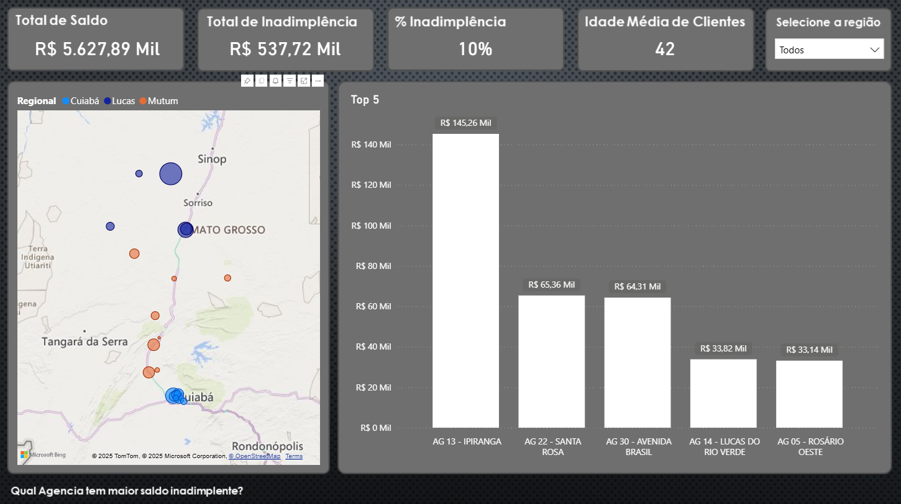
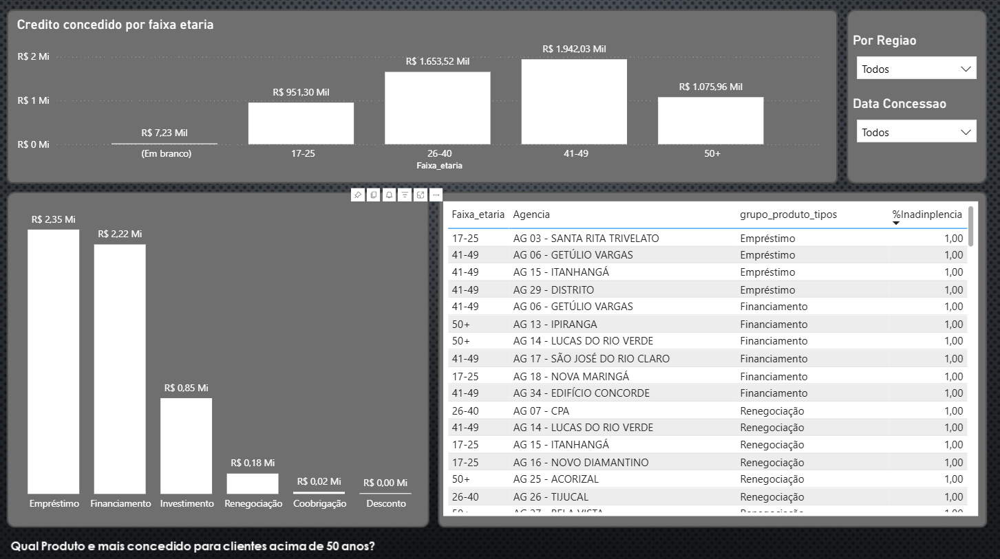

# data-analytics-powerBi
Dados em exibição não são reais.
# 📊 Dashboard Power BI – Análise de Indicadores

Este projeto tem como objetivo analisar dados operacionais e gerar insights por meio de um dashboard interativo desenvolvido no **Power BI**, utilizando dados tratados no **Excel** e cálculos criados com **DAX**.

O dashboard permite uma visão clara sobre saldos, inadimplência, distribuição por produto, agência e outros recortes analíticos.

---

## 🧰 Tecnologias Utilizadas

- **Microsoft Excel**  
  - Limpeza e organização dos dados  
  - Estruturação da base de dados  

- **Power BI Desktop**  
  - Modelagem de dados  
  - Criação de dashboards interativos  
  - Relacionamentos entre tabelas  

- **DAX (Data Analysis Expressions)**  
  - Medidas calculadas  
  - Indicadores de negócio  
  - Percentuais e métricas analíticas  

---

## 📈 Principais Métricas Criadas (DAX)

- Total de saldo  
- Total de inadimplência  
- Percentual de inadimplência  
- Idade média por produto  
- Indicadores por agência, segmento e regional  

---

## 🖥️ Visualizações Desenvolvidas

- Mapa de calor por saldo total e agência  
- Gráfico de barras empilhadas por segmento e produto  
- Cartões de indicadores (KPIs)  
- Filtros interativos por:
  - Regional  
  - Faixa etária  
  - Data de concessão  

---

## 🖼️ Exemplos do Dashboard

### Visão Geral

### Análise Detalhada

> ℹ️ *As imagens acima representam telas do dashboard final desenvolvido no Power BI.*

---

## 🧠 Perguntas de Negócio Respondidas

- Qual agência possui maior saldo inadimplente?  
- Qual produto é mais concedido para clientes acima de 50 anos?  
- Qual regional possui maior volume de crédito?  

---

## Author
### Josué Ocanha Costa
#### FrontEnd Developer
#### Redes Sociais

- Linkedin - [JosueOcanhaCosta](https://www.linkedin.com/in/josue-ocanha-costa/)
- Github - [JosueCosta2023](https://github.com/JosueCosta2023)
- Twitter - [@JosueOcanhaCosta](https://twitter.com/josue_ocanha)
- Facebook - [JosueCosta](https://www.facebook.com/JosueOcanhaCosta2023)
- Whatsapp - [Josue2023](https://wa.me/5565996408371?text=Ol%C3%A1%2C+encontrei+seu+whatsapp+no+Github.+Gostaria+de+falar+sobre+seus+projetos.)

# "Vida longa e próspera. 🖖🖖🖖"
Feito com o ❤️ por Josué Ocanha Costa

